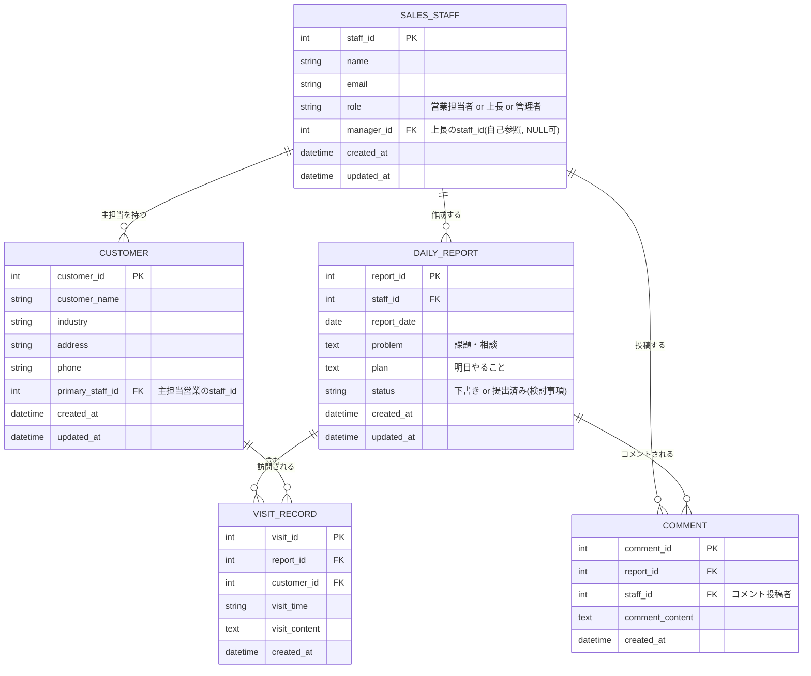

# 営業日報システム 要件定義書

作成日: 2026-08-14 / バージョン: 0.1(ドラフト)

## 1. システム概要

営業担当者が日々の訪問活動を記録・共有し、上長が課題(Problem)や翌日の計画(Plan)にコメントすることで、営業活動の可視化と日々のマネジメントを支援する。

| 利用者 | 役割 |
|---|---|
| 営業担当者 | 日々の訪問内容を日報として記録し、Problem/Planを記載する |
| 上長 | 配下の営業担当者が作成した日報を閲覧し、コメントを投稿する |
| 管理者 | 顧客マスタ・営業担当者マスタを維持管理する |

## 2. 用語定義

| 用語 | 説明 |
|---|---|
| 日報 | 営業担当者が1営業日につき1件作成する報告の単位。Problem・Planを含む |
| 訪問記録 | 日報に紐づく、訪問した顧客ごとの活動内容。1件の日報に複数行登録できる |
| Problem | 日報に記載する、現在の課題や相談事項 |
| Plan | 日報に記載する、翌営業日にやることの計画 |
| コメント | 日報(Problem/Plan含む)に対して上長などが投稿する返信。1件の日報に複数投稿できる |

## 3. 機能要件

### 3.1 日報・訪問記録
- FR-01 営業担当者は、当日訪問した顧客とその訪問内容を日報として登録できる
- FR-02 1件の日報に対し、訪問記録(顧客・訪問内容)を複数行追加できる
- FR-03 訪問記録の顧客は、顧客マスタから選択して登録する
- FR-04 営業担当者は自身の過去の日報を一覧・閲覧できる
- FR-05 上長は配下の営業担当者が作成した日報を一覧・閲覧できる

### 3.2 Problem / Plan・コメント
- FR-06 営業担当者は日報にProblem(現在の課題・相談)を記載できる
- FR-07 営業担当者は日報にPlan(明日やること)を記載できる
- FR-08 上長は日報に対してコメントを投稿できる
- FR-09 1件の日報に対して複数件のコメントを投稿できる
- FR-10 コメントには投稿者と投稿日時が記録される

### 3.3 マスタ管理
- FR-11 管理者は顧客マスタを登録・編集・削除できる
- FR-12 管理者は営業担当者マスタを登録・編集・削除できる
- FR-13 顧客には主担当の営業担当者を設定できる
- FR-14 営業担当者マスタは上長・部下の関係を保持し、コメント権限の判定に用いる

## 4. 検討事項

- 権限設計: 営業担当者は自分の日報のみ編集可、上長は配下分のみ閲覧・コメント可、という前提で良いか
- 一意制約: 日報は「営業担当者×報告日」で1件に限定してよいか
- ステータス: 日報に下書き/提出済みのようなステータスを持たせるか
- 通知: 日報提出時・コメント投稿時に通知(メール等)を行うか
- 保存期間・履歴: 日報・コメントの保持期間、編集履歴の保持要否

## 5. データモデル(ER図)

## 6. テーブル定義

### SALES_STAFF(営業担当者マスタ)
営業担当者・上長を1つのマスタで管理し、manager_id で上長・部下関係を表現する。

| カラム | 型 | 制約 | 説明 |
|---|---|---|---|
| staff_id | int | PK | 営業担当者ID |
| name | string | | 氏名 |
| email | string | UNIQUE | メールアドレス |
| role | string | | 営業担当者 / 上長 / 管理者 |
| manager_id | int | FK(自己参照) | 上長のstaff_id。NULL可 |
| created_at | datetime | | 作成日時 |
| updated_at | datetime | | 更新日時 |

### CUSTOMER(顧客マスタ)

| カラム | 型 | 制約 | 説明 |
|---|---|---|---|
| customer_id | int | PK | 顧客ID |
| customer_name | string | | 顧客名 |
| industry | string | | 業種 |
| address | string | | 住所 |
| phone | string | | 電話番号 |
| primary_staff_id | int | FK | 主担当営業のstaff_id |
| created_at | datetime | | 作成日時 |
| updated_at | datetime | | 更新日時 |

### DAILY_REPORT(日報)
staff_id と report_date の組み合わせを一意とする想定(検討事項参照)。

| カラム | 型 | 制約 | 説明 |
|---|---|---|---|
| report_id | int | PK | 日報ID |
| staff_id | int | FK | 作成した営業担当者 |
| report_date | date | UNIQUE(staff_id, report_date) | 報告対象日 |
| problem | text | | 課題・相談 |
| plan | text | | 明日やること |
| status | string | | 下書き / 提出済み(検討事項) |
| created_at | datetime | | 作成日時 |
| updated_at | datetime | | 更新日時 |

### VISIT_RECORD(訪問記録)
1件の日報に対して複数行登録できる、顧客ごとの訪問内容。

| カラム | 型 | 制約 | 説明 |
|---|---|---|---|
| visit_id | int | PK | 訪問記録ID |
| report_id | int | FK | 紐づく日報 |
| customer_id | int | FK | 訪問した顧客 |
| visit_time | string | | 訪問時刻(または順序) |
| visit_content | text | | 訪問内容 |
| created_at | datetime | | 作成日時 |

### COMMENT(コメント)
日報(Problem/Planを含む)に対する返信。投稿者はSALES_STAFFのいずれか(主に上長)。

| カラム | 型 | 制約 | 説明 |
|---|---|---|---|
| comment_id | int | PK | コメントID |
| report_id | int | FK | コメント対象の日報 |
| staff_id | int | FK | コメント投稿者 |
| comment_content | text | | コメント内容 |
| created_at | datetime | | 投稿日時 |
