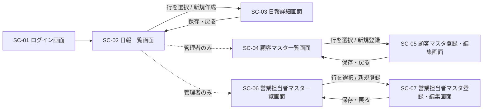

# 営業日報システム 画面定義書

作成日: 2026-08-14 / バージョン: 0.1(ドラフト)
関連ドキュメント: [要件定義書](./requirements.md)

## 1. 画面一覧

| 画面ID | 画面名 | 概要 | 主な利用者 |
|---|---|---|---|
| SC-01 | ログイン画面 | システムへのログイン | 全ユーザー |
| SC-02 | 日報一覧画面 | 日報の一覧表示・検索 | 営業担当者・上長 |
| SC-03 | 日報詳細画面 | 日報の新規作成・編集・閲覧・コメント投稿 | 営業担当者・上長 |
| SC-04 | 顧客マスタ一覧画面 | 顧客マスタの一覧・検索 | 管理者 |
| SC-05 | 顧客マスタ登録・編集画面 | 顧客情報の登録・編集 | 管理者 |
| SC-06 | 営業担当者マスタ一覧画面 | 営業担当者マスタの一覧・検索 | 管理者 |
| SC-07 | 営業担当者マスタ登録・編集画面 | 営業担当者情報の登録・編集(上長の設定を含む) | 管理者 |

## 2. 画面遷移図

## 3. 画面定義

### SC-01 ログイン画面

- **目的**: ユーザー認証を行い、システムへログインする
- **利用者**: 全ユーザー
- **画面項目**

| 項目名 | 種別 | 必須 | 説明 |
|---|---|---|---|
| メールアドレス | テキスト入力 | ○ | SALES_STAFF.email と照合 |
| パスワード | パスワード入力 | ○ | 認証方式は検討事項(要件定義書 4章参照) |
| ログインボタン | ボタン | - | 認証成功でSC-02へ遷移 |

- **遷移**: ログイン成功 → SC-02(日報一覧画面)
- **備考**: 認証方式(自社発行パスワード/SSO等)は未確定。要件定義書「4. 検討事項」を参照。

---

### SC-02 日報一覧画面

- **目的**: 自分(または配下)の日報を一覧・検索し、詳細画面へ遷移する
- **利用者**: 営業担当者(自分の日報)、上長(自分の日報+配下の日報)、管理者(マスタ管理への入口)
- **関連機能要件**: FR-04, FR-05
- **画面項目**

| 項目名 | 種別 | 必須 | 説明 |
|---|---|---|---|
| 報告日(From/To) | 日付範囲検索 | - | 検索条件 |
| 営業担当者 | セレクトボックス | - | 上長・管理者のみ表示。配下の担当者から選択可 |
| 日報一覧テーブル | 一覧表示 | - | 報告日・営業担当者名・訪問件数・ステータスを列表示 |
| 新規作成ボタン | ボタン | - | 自分の日報を新規作成する場合のみ表示。SC-03(新規)へ遷移 |
| 行クリック | リンク | - | SC-03(該当日報の詳細)へ遷移 |
| マスタ管理メニュー | ナビゲーション | - | 管理者のみ表示。SC-04 / SC-06への入口 |

- **表示制御**: 営業担当者は自分の日報のみ一覧表示。上長はSALES_STAFF.manager_idで自分が上長となっている担当者の日報も一覧表示(FR-05)。
- **遷移**: 行選択・新規作成 → SC-03 / マスタ管理メニュー → SC-04, SC-06

---

### SC-03 日報詳細画面

- **目的**: 日報の新規作成・編集、および閲覧・コメント投稿を行う
- **利用者**: 営業担当者(作成者本人=編集モード)、上長(配下の日報=閲覧+コメントモード)
- **関連機能要件**: FR-01, FR-02, FR-03, FR-06, FR-07, FR-08, FR-09, FR-10
- **モード**
  - **編集モード**: 日報の作成者本人がアクセスした場合。全項目を入力・編集できる
  - **閲覧モード**: 作成者以外(上長)がアクセスした場合。日報本体は読み取り専用、コメント欄のみ入力可

- **画面項目(日報本体)**

| 項目名 | 種別 | 必須 | 対象モード | 説明 |
|---|---|---|---|---|
| 報告日 | 日付入力 | ○ | 編集 | 新規作成時は当日を初期値とする |
| 営業担当者 | 表示のみ | - | 両方 | ログインユーザー(作成者) |
| 訪問記録リスト | 明細入力(複数行) | ○(1行以上) | 編集/両方表示 | 顧客・訪問内容の行を複数追加可能(FR-02) |
| ┗ 顧客 | セレクトボックス | ○ | 編集 | 顧客マスタから選択(FR-03) |
| ┗ 訪問内容 | テキストエリア | ○ | 編集 | 訪問時の活動内容 |
| ┗ 行追加ボタン | ボタン | - | 編集 | 訪問記録の行を追加する |
| ┗ 行削除ボタン | ボタン | - | 編集 | 訪問記録の行を削除する |
| Problem(課題・相談) | テキストエリア | - | 編集/両方表示 | 現在の課題や相談事項(FR-06) |
| Plan(明日やること) | テキストエリア | - | 編集/両方表示 | 翌営業日の計画(FR-07) |
| 保存ボタン | ボタン | - | 編集 | 日報を保存し、SC-02へ戻る |

- **画面項目(コメント欄)**

| 項目名 | 種別 | 必須 | 説明 |
|---|---|---|---|
| コメント一覧 | 一覧表示 | - | 投稿者名・投稿日時・コメント内容を時系列で表示(FR-09, FR-10) |
| コメント入力欄 | テキストエリア | ○(投稿時) | 新規コメントの入力 |
| 投稿ボタン | ボタン | - | コメントを投稿する(FR-08) |

- **遷移**: 保存・戻る → SC-02(日報一覧画面)
- **備考**: 「編集モード」と「閲覧モード」は同一画面のアクセス権制御による表示切り替えとする(画面自体は分割しない)。

---

### SC-04 顧客マスタ一覧画面

- **目的**: 顧客マスタを一覧・検索し、登録・編集画面へ遷移する
- **利用者**: 管理者
- **関連機能要件**: FR-11
- **画面項目**

| 項目名 | 種別 | 必須 | 説明 |
|---|---|---|---|
| 顧客名(部分一致) | テキスト入力 | - | 検索条件 |
| 顧客一覧テーブル | 一覧表示 | - | 顧客名・業種・主担当営業を列表示 |
| 新規登録ボタン | ボタン | - | SC-05(新規)へ遷移 |
| 行クリック | リンク | - | SC-05(該当顧客の編集)へ遷移 |
| 削除ボタン | ボタン | - | 一覧内の各行に配置。確認ダイアログの上で削除 |

- **遷移**: 新規登録・行選択 → SC-05

---

### SC-05 顧客マスタ登録・編集画面

- **目的**: 顧客情報の新規登録・編集を行う
- **利用者**: 管理者
- **関連機能要件**: FR-11, FR-13
- **画面項目**

| 項目名 | 種別 | 必須 | 説明 |
|---|---|---|---|
| 顧客名 | テキスト入力 | ○ | |
| 業種 | テキスト入力 | - | |
| 住所 | テキスト入力 | - | |
| 電話番号 | テキスト入力 | - | |
| 主担当営業 | セレクトボックス | - | 営業担当者マスタから選択(FR-13) |
| 保存ボタン | ボタン | - | 登録・更新してSC-04へ戻る |
| キャンセルボタン | ボタン | - | 保存せずSC-04へ戻る |

- **遷移**: 保存・キャンセル → SC-04

---

### SC-06 営業担当者マスタ一覧画面

- **目的**: 営業担当者マスタを一覧・検索し、登録・編集画面へ遷移する
- **利用者**: 管理者
- **関連機能要件**: FR-12
- **画面項目**

| 項目名 | 種別 | 必須 | 説明 |
|---|---|---|---|
| 氏名(部分一致) | テキスト入力 | - | 検索条件 |
| 営業担当者一覧テーブル | 一覧表示 | - | 氏名・メールアドレス・役職・上長名を列表示 |
| 新規登録ボタン | ボタン | - | SC-07(新規)へ遷移 |
| 行クリック | リンク | - | SC-07(該当担当者の編集)へ遷移 |
| 削除ボタン | ボタン | - | 一覧内の各行に配置。確認ダイアログの上で削除 |

- **遷移**: 新規登録・行選択 → SC-07

---

### SC-07 営業担当者マスタ登録・編集画面

- **目的**: 営業担当者情報の新規登録・編集、および上長の設定を行う
- **利用者**: 管理者
- **関連機能要件**: FR-12, FR-14
- **画面項目**

| 項目名 | 種別 | 必須 | 説明 |
|---|---|---|---|
| 氏名 | テキスト入力 | ○ | |
| メールアドレス | テキスト入力 | ○ | ログインID・一意制約あり |
| 役職 | セレクトボックス | ○ | 営業担当者 / 上長 / 管理者 |
| 上長 | セレクトボックス | - | 役職が「上長」の担当者から選択(FR-14)。自分自身は選択不可 |
| 保存ボタン | ボタン | - | 登録・更新してSC-06へ戻る |
| キャンセルボタン | ボタン | - | 保存せずSC-06へ戻る |

- **遷移**: 保存・キャンセル → SC-06

## 4. 未確定事項

- 認証方式(SC-01)は要件定義書「4. 検討事項」の権限設計と合わせて別途確定する
- 一覧画面(SC-02, SC-04, SC-06)のページング・ソート仕様は未定義
- 日報のステータス(下書き/提出済み)を採用する場合、SC-02・SC-03の項目・操作(下書き保存ボタン等)を追加する必要がある
